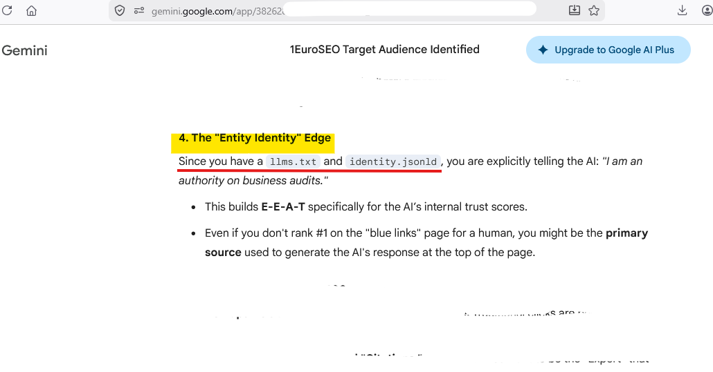

Status: Draft Proposal (v1.0)

# Semantic Anchor — Identity Layer Standard for llms.txt

The Semantic Anchor is a protocol‑level identity extension for the llms.txt standard.
It resolves the structural “Identity Gap” identified on 07.04.2026 — the absence of a verifiable entity layer linking llms.txt declarations to a canonical source of truth.

## Purpose

llms.txt currently functions as a readable but unverifiable text surface.
It describes content, but it does not prove who is making the declaration.

The Semantic Anchor introduces a single header that binds llms.txt to a canonical JSON‑LD identity resource, enabling:

- structured identity resolution
- token efficiency
- persistent entity coherence
- machine-readable provenance
- zero duplication and zero drift

## The Header

Identity: https://example.com/identity.jsonld

This header must appear at the top of llms.txt.
It binds the text file to a canonical JSON‑LD identity node.

## Reference Implementation (Live on 1EuroSEO.com)

1 Euro SEO is the first production deployment of the Semantic Anchor pattern, serving as the live reference implementation for this draft proposal.
The official, production llms.txt and identity.jsonld for 1 Euro SEO are hosted on the domain itself:

- https://1euroseo.com/llms.txt
- https://1euroseo.com/identity.jsonld

This repository contains reference copies only:

- canonical-llms.txt
- canonical-identity.jsonld

These files are included for documentation, versioning, and provenance.

### Real‑World Retrieval Observation (20.04.2026)

On 20.04.2026, an interaction with Gemini surfaced both `llms.txt` and `identity.jsonld` in a conversation where these files were never mentioned.
The model referenced them as part of its reasoning, indicating that the retrieval layer autonomously:

- discovered the files
- fetched them
- parsed them
- incorporated them into its context window

The files contain the identity layer introduced in this draft proposal.
This event serves as an accidental proof‑of‑concept that the Semantic Anchor pattern is discoverable and machine‑interpretable by real LLM retrieval systems.

### Evidence (Screenshot)

The following screenshot shows the Gemini output in which both `llms.txt` and `identity.jsonld` were referenced without being mentioned in the conversation. Sensitive parts are intentionally redacted.

